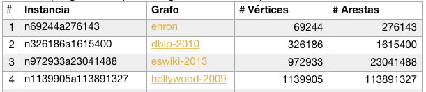
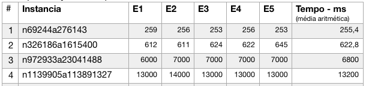
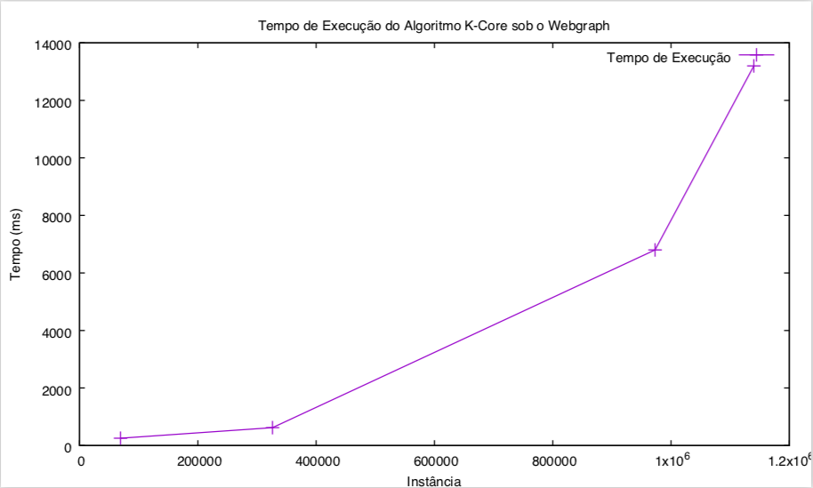

# Implementação do Algoritmo para Encontrar k-cores em Tempo Linear no Topo do Webgraph

Este trabalho foi desenvolvido no âmbito da unidade curricular de Redes Complexas no IST-ULisboa e tem como objectivo ilustrar a utilização da framework Webgraph como ferramenta para análise de redes complexas e para desenvolvimento de algoritmos de grafos no topo deste framework. É implementado o algoritmo para encontrar k-cores em tempo linear no topo do Webgraph e é avaliado, para um conjunto de instancias selecionado, se o algoritmo tem tempo linear em aproximação.

## Getting Started

Estas instruções permitem configurar e executar o programa em seu host.

### Pré-requisitos

Para executar directamente os bytecode dispon]ivel é necessário o JDK 1.8, caso tenha outra versão instalada terá de recompilar o programa:

```
$ javac -cp lib/'*':. KCoreAlgorithm.java
```

### Usar outras instancias para o algoritmo (outros datasets)

Para os experimentos selecionamos 4 datasets (tabela abaixo) para exploração, todos disponíveis em [1](http://law.di.unimi.it/datasets.php). O formato para as instancia escolhido foi n<x>a<y>, onde <x> é o número de vértices e <y> é o número de arestas. Para obter os dados e prepará-los basta executar os comandos seguinte para cada grafo (no caso, ilustraremos para o grafo enron):

```
$ wget http://data.law.di.unimi.it/webdata/enron/enron.graph
$ wget http://data.law.di.unimi.it/webdata/enron/enron.properties
$ java -cp lib/'*' it.unimi.dsi.webgraph.BVGraph -o -O -L enron
$ java -cp lib/'*' it.unimi.dsi.webgraph.Transform symmetrizeOffline enron n69244a276143
```

As duas primeiras linhas obtêm o grafo e a respectiva propriedade, na terceira linha é gerado o offset para o grafo e na quarta linha é feita a transformação para um grafo não orientado (o algoritmo é aplicado à grafo não orientado).

A tabela a seguir corresponde ao conjunto de datasets selecionados para os experimentos:



## Executar o programa

Para executar o programa basta os seguintes comandos (4 instancias usadas para teste):

```
java -cp lib/'*':. KCoreAlgorithm -s n69244a276143
java -cp lib/'*':. KCoreAlgorithm -s n326186a1615400
java -cp lib/'*':. KCoreAlgorithm -s n972933a23041488
```

A tabela a seguir apresenta as execuções para cada instancia e a respectiva média usada como tempo de executação aproximado:



O gráfico abaixo representa a correlação entre o tempo aproximado e as instancia para aferir a complexidade do algoritmo:




